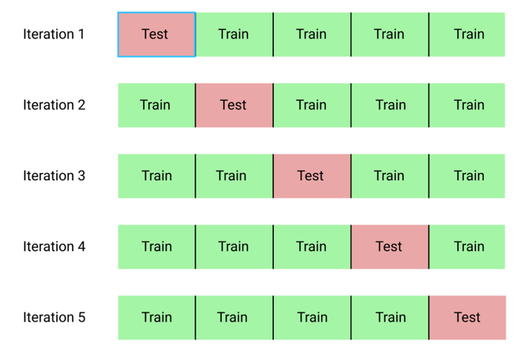

# Cross Validation

Divide the data into K equal-sized arts. taking one group as the test data set (holdout set), and the other k-1 groups as the training data, fitting and evaluating a model, and recording the chosen score. This process is then repeated with each fold (group) as the test data and all the scores averaged to obtain a more comprehensive model validation score. (k increases, bias decreases and variance increases) 

### Pro

- Each split uses different data for training and testing purposes, allowing the model to be trained and tested with different data each time.This allows the algorithm to be trained and tested with all available data across all folds, avoiding any splitting bias

### Con

- Requires the model to be trained for each fold, so the **computational cost** can be very high for complex models or huge datasets

